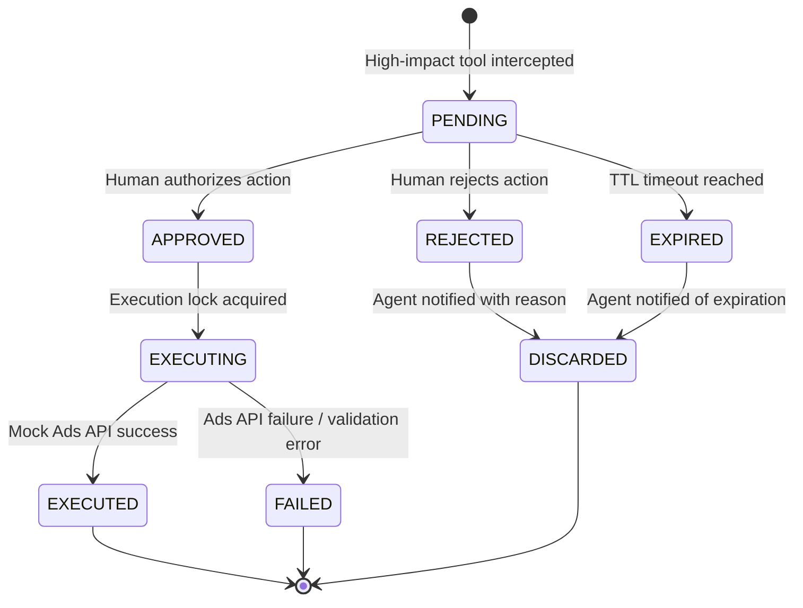

# Foxtly — Human-in-the-Loop (HITL) Approval Gate Architecture Spec

**Author:** Arthur Ramos  
**Role:** Mid/Senior Full-Stack & AI Systems Developer  
**Status:** Approved for Prototype Implementation  

---

## 1. Executive Summary & Context

Foxtly's autonomous agents monitor client campaigns on Meta and Google Ads, detect anomalies, and take corrective actions via an iterative tool-use loop powered by Anthropic Claude. While low-risk read actions (fetching metrics, inspecting campaign settings) can execute autonomously, high-impact mutations (budget changes, pausing ad sets, bid strategy modifications) carry financial and operational risk.

This document specifies the **Approval Gate**: an interception and state persistence mechanism that halts high-impact actions, requests human intervention, and securely resumes the agent workflow upon authorization.

---

## 2. Agent Loop Integration & Interception Point

### 2.1 Where Interception Occurs
In a standard Claude tool-use cycle:
1. The **Analyst/Executor Agent** sends the conversation history and available tool definitions to Claude.
2. Claude responds with a message containing one or more `tool_use` blocks.
3. **The Approval Gate intercepts here**: before invoking the target tool handler (e.g., `update_campaign_budget`), a **Policy Gatekeeper** inspects the tool name, its arguments, and threshold rules.

```
                  ┌────────────────────────┐
                  │   Claude API Response  │
                  └───────────┬────────────┘
                              │
                    Contains tool_use block
                              │
                              ▼
                  ┌────────────────────────┐
                  │   Policy Gatekeeper    │
                  └───────────┬────────────┘
                              │
              Is tool classified as High-Impact?
                     /                 \
                   YES                  NO
                   /                     \
                  ▼                       ▼
    ┌───────────────────────────┐   ┌───────────────────────────┐
    │ 1. Halt Tool Execution    │   │ Execute Tool Immediately  │
    │ 2. Create Pending Approval│   │ Return tool_result block  │
    │ 3. Suspend Agent Workflow │   │ Continue Claude Loop      │
    └───────────────────────────┘   └───────────────────────────┘
```

### 2.2 What Happens to the Loop While Pending?
- **Asynchronous Suspension (No Active Polling):** The execution thread/worker does **not** block or busy-wait. 
- The complete agent conversation context (message history, pending `tool_use_id`, parameters, and execution metadata) is serialized and persisted.
- The external caller receives a status of `AWAITING_APPROVAL` with the `approval_id`.
- The agent loop enters a dormant state until a human action triggers a webhook/resume signal.

---

## 3. Approval State Machine

To prevent race conditions, double executions, and stale state transitions, the lifecycle of an approval is governed by a strict deterministic state machine:



### 3.1 State Transitions & Invariants

| State | Allowed Next States | Trigger | Invariant / Safety Rule |
| :--- | :--- | :--- | :--- |
| `PENDING` | `APPROVED`, `REJECTED`, `EXPIRED` | Human click via API/UI or Timer TTL | Action has **NOT** touched the Ads API. Context is immutable. |
| `APPROVED` | `EXECUTING` | System worker picks up approved task | Transition must use atomic compare-and-swap (CAS) to prevent double execution. |
| `EXECUTING` | `EXECUTED`, `FAILED` | Tool handler resolves or throws | If network crashes, idempotent retry key ensures no duplicate ad spend. |
| `REJECTED` | `DISCARDED` | Human rejects with optional feedback | Tool is **never executed**. Claude receives explicit rejection `tool_result`. |
| `EXPIRED` | `DISCARDED` | Expiration daemon (e.g., > 24h old) | Prevents applying actions when underlying market conditions have shifted. |

### 3.2 Behavior on Approve vs. Reject

- **On Approve:**
  1. Status updates atomically: `PENDING` → `APPROVED` → `EXECUTING`.
  2. The actual Ads API action is executed with the original verified parameters.
  3. The result is packaged into a standard Anthropic `tool_result` message block (`is_error: false`).
  4. The agent loop resumes, appending the `tool_result` to the conversation history and prompting Claude for next steps.

- **On Reject:**
  1. Status updates to `REJECTED` (with reviewer notes, e.g., *"Budget increase too aggressive for Q3"*).
  2. The tool action is discarded without executing against the ad platform.
  3. A synthetic `tool_result` is sent back to Claude explaining the human rejection:
     ```json
     {
       "type": "tool_result",
       "tool_use_id": "toolu_01...",
       "content": "Action rejected by human reviewer: Budget increase exceeding $500/day requires director approval. Please propose an alternative strategy.",
       "is_error": true
     }
     ```
  4. Claude receives this context and autonomously reasons about an alternative solution (e.g., reallocating existing budget rather than requesting new funds).

---

## 4. Concurrency & Conflicting Actions

**Scenario:** What if the agent generates multiple actions or tries to execute another tool while a previous one is pending?

### 4.1 Session & Campaign-Level Locks
When an approval enters `PENDING`:
1. A **Campaign Lock** is placed on the target `campaign_id` / `workspace_id`.
2. The agent cannot schedule secondary mutations on the same campaign while a prerequisite action is pending, preventing cascade failures (e.g., changing ad copy for a campaign that might be paused).
3. If Claude attempts a batch of tool calls in a single response where one is high-impact:
   - All preceding low-impact read tools execute immediately.
   - The first high-impact tool halts the batch.
   - Subsequent dependent tools are queued or evaluated only after the primary approval resolves.

---

## 5. Production Considerations & Engineering Questions

Before deploying this to high-volume production at Foxtly, the following technical considerations must be addressed:

1. **Idempotency Keys:** Ad platform APIs (Meta Marketing API / Google Ads API) must receive an `Idempotency-Key` (derived from `approval_id`) to ensure network retries never double-charge or create duplicate ad sets.
2. **Context Window Drift & Token Cost:** If an approval sits pending for 12 hours, campaign metrics (CPA, CTR, spend) may have drastically changed. Should we inject a "Market State Refresh" system message into Claude's context upon resumption?
3. **Multi-Tenant Isolation & RLS:** Approvals must be strictly scoped by `workspace_id` in Supabase with Postgres Row-Level Security (RLS) so users can only view and authorize actions within their ad accounts.
4. **Audit Trail & SOC2 Compliance:** Every approval must log:
   - `requested_by` (Agent Model + Version + Prompt Hash)
   - `reviewed_by` (User ID / Email)
   - `reviewed_at` (Timestamp with timezone)
   - `original_diff` (Exact JSON diff of before vs. after settings).
5. **Durable Workflow Engine:** In production, rather than holding state in Node.js process memory, this pipeline should be modeled as an **Inngest** or **Temporal** workflow with durable step functions and webhook listeners.
